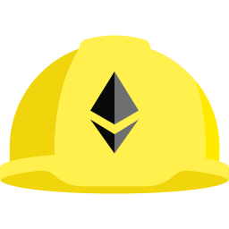
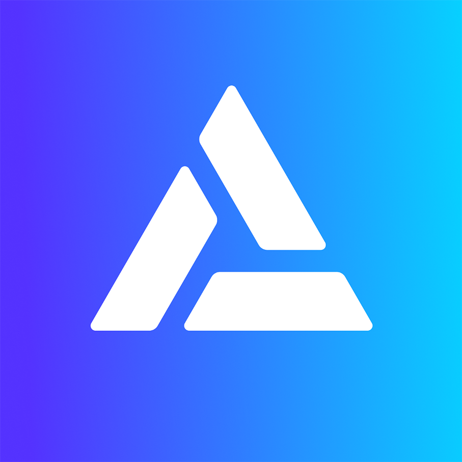
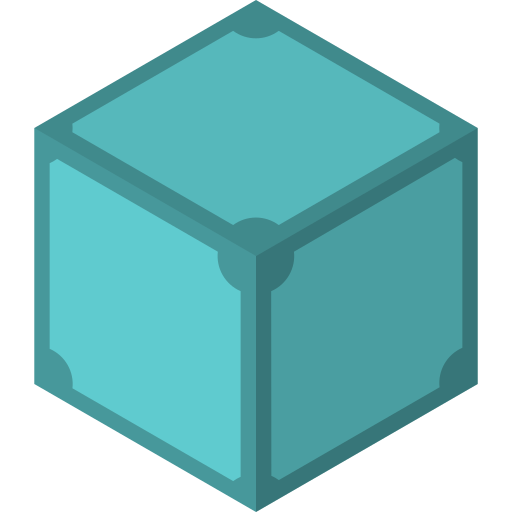

<a name="readme-top"></a>

<!-- PROJECT LOGO -->
<br />
<div align="center">
  <a href="https://github.com/polar0/full-blockchain-solidity-course-js">
    
  </a>

<h2 align="center">Full Blockchain, Solidity & Full-Stack Web3 development with JavaScript </h3>

  <p align="center">
    Everything related to my progress through <a href="https://youtu.be/gyMwXuJrbJQ">this course from Patrick Collins</a>
    <br />
    <a href="https://youtu.be/gyMwXuJrbJQ"><strong>Go to the video »</strong></a>
  </p>
</div>

<br />

<!-- TABLE OF CONTENTS -->
<details>
  <summary>Table of Contents</summary>
  <ol>
    <li>
      <a href="#about-the-project">About The Project</a>
    </li>
    <li>
      <a href="#testing">Trying out / testing</a>
    </li>
    <li>
      <a href="#lessons">Lessons</a>
      <ul>
        <li><a href="#mission-00">Mission 00: Remix & Solidity Basics</a></li>
        <li><a href="#mission-01">Mission 01: Ethers - Simple Storage</a></li>
        <li><a href="#mission-02">Mission 02: Hardhat - Simple Storage</a></li>
        <li><a href="#mission-03">Mission 03: Hardhat - Fund Me</a></li>
        <li><a href="#mission-04">Mission 04: HTML - Fund Me</a></li>
        <li><a href="#mission-05">Mission 05: Hardhat - Lottery Smart Contract</a></li>
        <li><a href="#mission-06">Mission 06: Next.js Front End - Lottery Smart Contract</a></li>
        <li><a href="#mission-07">Mission 07: Hardhat - ERC20 Token</a></li>
        <li><a href="#mission-08">Mission 08: DeFi</a></li>
        <li><a href="#mission-09">Mission 09: NFT - IPFS, fully on-chain, randomized, dynamic...</a></li>
      </ul>
    </li>
    <li><a href="#license">License</a></li>
    <li><a href="#contact">Contact</a></li>

  </ol>
</details>

<br />

<!-- ABOUT THE PROJECT -->

# About The Project

While following this course, I frequently pushed my progress to GitHub, to keep track of it. The purpose of this resource is to document this growth, providing details at each step of the journey about the mission achieved, and the new skills acquired. Enjoy the glow up!

<p align="center">








</p>

<!-- GETTING STARTED -->

<!----><a id="testing"></a>

# Trying out / testing

<p>To get a local copy up and running follow these simple example steps.</p>
<p>You will need to install either <strong>npm</strong> or <strong>yarn</strong> to run the commands, and <strong>git</strong> to clone the repository.</p>

## Installation

1. Clone the repo:
   ```sh
   git clone https://github.com/polar0/full-blockchain-solidity-course-js.git
   ```
2. Navigate into a subdirectory:
   ```sh
   cd name-of-the-subdirectory
   ```
3. Install NPM packages using `yarn` or `npm install`.

## Usage

Deploy:

```sh
yarn hardhat deploy
```

Run tests:

```sh
yarn hardhat test
```

Test coverage:

```sh
yarn hardhat coverage
```

# Lessons

<!-- MISSION 00 -->

## <a href="https://github.com/polar0/full-blockchain-solidity-course-js/tree/main/00-remix-solidity-basics/contracts" id="mission-00"></a>

### Achievements

- Writing a basic smart contract with Solidity
- Compiling & Deploying the contract (VM or testnet)
- Interacting between contracts
- Interacting with the contract after it's deployed
- Using Chainlink for price feeds

### Skills

[![Solidity]](https://soliditylang.org/)
[![Remix]](https://remix.ethereum.org/)
[![Chainlink]](https://chain.link/)

#

<!-- MISSION 01 -->

<a href="https://github.com/polar0/full-blockchain-solidity-course-js/tree/main/01-ethers-simple-storage" id="mission-01"></a>

### Achievements

- Working in a local environment
- Using Ganache to simulate a blockchain
- Using Ethers.js to interact with a contract
- Private key management, key encryption
- Using Alchemy RPC & Dashboard

### Skills

[![Solidity]](https://soliditylang.org/)
[![JavaScript]](https://developer.mozilla.org/fr/docs/Web/JavaScript)
[![Ganache]](https://trufflesuite.com/ganache/)
[![EthersJS]](https://docs.ethers.io/v5/)
[![NodeJS]](https://nodejs.org/)
[![Alchemy]](https://www.alchemy.com/)

#

<!-- MISSION 02 -->

<a href="https://github.com/polar0/full-blockchain-solidity-course-js/tree/main/02-hardhat-simple-storage" id="mission-02"></a>

### Achievements

- Using the Hardhat framework
  - Deploying contracts
  - Using networks (Hardhat node, testnet)
  - Verifying a contract with Etherscan
  - Interacting with contracts
  - Custom tasks & scripts
  - Testing with Mocha & Chai, tracking Solidity coverage
  - Using the gas reporter

### Skills

[![Solidity]](https://soliditylang.org/)
[![JavaScript]](https://developer.mozilla.org/fr/docs/Web/JavaScript)
[![Hardhat]](https://hardhat.org/)
[![Chai]](https://www.chaijs.com/)
[![Mocha]](https://mochajs.org/)

#

<!-- MISSION 03 -->

<a href="https://github.com/polar0/full-blockchain-solidity-course-js/tree/main/03-hardhat-fund-me" id="mission-03"></a>

### Achievements

- Deploying multiple/selected contracts with Hardhat
- Mocking a Chainlink price feed for testing
- Unit & Staging tests
- Interacting with storage in Solidity
- Gas optimization, using storage, immutable & constant variables

### Skills

[![Solidity]](https://soliditylang.org/)
[![JavaScript]](https://developer.mozilla.org/fr/docs/Web/JavaScript)
[![Hardhat]](https://hardhat.org/)
[![Chai]](https://www.chaijs.com/)
[![Mocha]](https://mochajs.org/)
[![Chainlink]](https://chain.link/)

#

<!-- MISSION 04 -->

<a href="https://github.com/polar0/full-blockchain-solidity-course-js/tree/main/04-html-fund-me" id="mission-04"></a>

### Achievements

- Implement a minimalistic Front End for the FundMe contract
- Using Ethers.js to interact with MetaMask
- Listening for events & transactions with `Promise` and `provider.once`

### Skills

[![Solidity]](https://soliditylang.org/)
[![JavaScript]](https://developer.mozilla.org/fr/docs/Web/JavaScript)
[![EthersJS]](https://docs.ethers.io/v5/)

#

<!-- MISSION 05 -->

<a href="https://github.com/polar0/full-blockchain-solidity-course-js/tree/main/05-hardhat-smartcontract-lottery" id="mission-05"></a>

### Achievements

- Write a provably fair raffle system using RNG with <a href="https://docs.chain.link/docs/vrf/v2/introduction/">Chainlink VRF</a> & <a href="https://docs.chain.link/docs/chainlink-automation/introduction/">Chainlink Keepers</a>
- Using & testing Solidity Events
- Using `evm_increaseTime` & `evm_mine` with Hardhat, special methods
- More in depth staging tests

### Skills

[![Solidity]](https://soliditylang.org/)
[![JavaScript]](https://developer.mozilla.org/fr/docs/Web/JavaScript)
[![Hardhat]](https://hardhat.org/)
[![Chai]](https://www.chaijs.com/)
[![Mocha]](https://mochajs.org/)
[![Chainlink]](https://chain.link/)

#

<!-- MISSION 06 -->

<a href="https://github.com/polar0/full-blockchain-solidity-course-js/tree/main/06-nextjs-smartcontract-lottery" id="mission-06"></a>

### Achievements

- Using Next.js to build a Front End for the lottery smart contract
- Using Moralis & React hooks to pass data/events through components
- Writing to/reading local storage to keep track of wallets connected
- Using web3uikit to connect a wallet to the provider & dispatch notifications about transactions
- Basic styling with TailwindCSS
- Hosting the website on IPFS
  - Directly pinning the website to a node
  - Using Fleek to host on IPFS & Filecoin

### Skills

[![Solidity]](https://soliditylang.org/)
[![JavaScript]](https://developer.mozilla.org/fr/docs/Web/JavaScript)
[![ReactJS]](https://reactjs.org/)
[![NextJS]](https://nextjs.org/)
[![Moralis]](https://moralis.io/)
[![IPFS]](https://ipfs.tech/)

#

<!-- MISSION 07 -->

<a href="https://github.com/polar0/full-blockchain-solidity-course-js/tree/main/07-hardhat-erc20" id="mission-07"></a>

### Achievements

- Creating an ERC20 Token with the basic requirements
- Using Openzeppelin to create the token
- Usual unit testing for the inherited functions

### Skills

[![Solidity]](https://soliditylang.org/)
[![JavaScript]](https://developer.mozilla.org/fr/docs/Web/JavaScript)
[![Hardhat]](https://hardhat.org/)
[![Chai]](https://www.chaijs.com/)
[![Mocha]](https://mochajs.org/)

#

<!-- MISSION 08 -->

<a href="https://github.com/polar0/full-blockchain-solidity-course-js/tree/main/08-defi" id="mission-08"></a>

### Achievements

- Using scripts for borrowing & lending with Aave
  - Using the wETH token contract to exchange ETH for wETH
  - Depositing wETH into Aave
  - Borrowing DAI from Aave
  - Repaying DAI to Aave
- Forking mainnet with Hardhat

### Skills

[![Solidity]](https://soliditylang.org/)
[![JavaScript]](https://developer.mozilla.org/fr/docs/Web/JavaScript)
[![Hardhat]](https://hardhat.org/)
[![Chai]](https://www.chaijs.com/)
[![Mocha]](https://mochajs.org/)
[![Aave]](https://developer.mozilla.org/fr/docs/Web/JavaScript)

#

<!-- MISSION 09 -->

<a href="https://github.com/polar0/full-blockchain-solidity-course-js/tree/main/09-hardhat-nft" id="mission-09"></a>

### Achievements

- Deploying an ERC721 token & hosting the image on IPFS
- Getting the data to be pinned with Pinata & upload the images URIs
- Using Chainlink VRF to issue a verifiable random rarity when the NFT is minted
- Deploy a smart contract to dynamically generate the NFT URI, based on on-chain price feeds
- Base64 Encoding/Decoding
- EVM opcodes, encoding & calling functions directly from contract

### Skills

[![Solidity]](https://soliditylang.org/)
[![JavaScript]](https://developer.mozilla.org/fr/docs/Web/JavaScript)
[![Hardhat]](https://hardhat.org/)
[![Chai]](https://www.chaijs.com/)
[![Mocha]](https://mochajs.org/)
[![Chainlink]](https://chain.link/)
[![Pinata]](https://www.pinata.cloud/)

<!-- MISSION 10 -->

<a href="https://github.com/polar0/full-blockchain-solidity-course-js/tree/main/10-hardhat-nft-marketplace" id="mission-10"></a>

### Achievements

- Creating a marketplace for NFTs based on the ERC721 standard
- Pull over push considerations, reentrancy attacks
- Advanced events & modifiers, security improvements
- Writing various scripts to interact with the contract

### Bonus achievements

- Deploying the marketplace & NFT contracts to Polygon (Mumbai) & Arbitrum (Goerli) (cf. Mission 12)

### Skills

[![Solidity]](https://soliditylang.org/)
[![JavaScript]](https://developer.mozilla.org/fr/docs/Web/JavaScript)
[![Hardhat]](https://hardhat.org/)
[![Chai]](https://www.chaijs.com/)
[![Mocha]](https://mochajs.org/)

<!-- MISSION 11 -->

<a href="https://github.com/polar0/full-blockchain-solidity-course-js/tree/main/11-nextjs-nft-marketplace-moralis" id="mission-11"></a>

### Achievements

- Connecting Moralis to a local hardhat node
- Using Moralis CLI & Cloud fonctions, triggers & hooks
- Moralis queries, fetching URIs & rendering the NFT images
- Building a front end for buying, listing (updating, canceling) NFTs & witdrawing funds

### Bonus achievements

- Using Rainbowkit & Wagmi to interact with the blockchain (Wallet connection & transactions with the smart contract)
- Using Antd Design for various components (Modal, Button, Input) & Skeleton for loading cards

### Skills

[![Solidity]](https://soliditylang.org/)
[![JavaScript]](https://developer.mozilla.org/fr/docs/Web/JavaScript)
[![ReactJS]](https://reactjs.org/)
[![NextJS]](https://nextjs.org/)
[![Moralis]](https://moralis.io/)
[![Rainbow]](https://www.rainbowkit.com/)
[![Wagmi]](https://wagmi.sh/)
[![Antd]](https://ant.design/)

<!-- MISSION 12 -->

<a href="https://github.com/polar0/full-blockchain-solidity-course-js/tree/main/12a-nextjs-nft-marketplace-thegraph" id="mission-12"></a>

### Achievements

- Building a subgraph to index the marketplace contract events (The Graph Studio)
- Using The Graph CLI to deploy the subgraph
- Querying the subgraph with GraphQL & Apollo client
- Hosting the Marketplace:
  - Fleek (IPFS): https://calm-forest-4357.on.fleek.co/
  - Vercel: https://nextjs-nft-marketplace-thegraph-murex.vercel.app/

### Bonus achievements

- Customizing the UI & UX
- Building a minting page for the NFT that can be listed
- Handling notifications: success, error & displaying pending transactions with React-Toastify
- Displaying 3 different marketplace listing pages for the chains it's deployed on (Polygon, Arbitrum & Ethereum testnets)
- Deploying 3 different subgraphs with The Graph Studio & Hosted Services on these 3 networks
- Listings filtering (All & Owned by the user)

### Skills

[![Solidity]](https://soliditylang.org/)
[![JavaScript]](https://developer.mozilla.org/fr/docs/Web/JavaScript)
[![ReactJS]](https://reactjs.org/)
[![NextJS]](https://nextjs.org/)
[![TheGraph]](https://thegraph.com/en/)
[![ApolloGraphQL]](https://www.apollographql.com/)
[![GraphQL]](https://graphql.org/)
[![Rainbow]](https://www.rainbowkit.com/)
[![Wagmi]](https://wagmi.sh/)
[![Antd]](https://ant.design/)

# License

Distributed under the MIT License. See `LICENSE.txt` for more information.

<!----><a id="contact"></a>

# Contact - Social

[![Website][website]](https://polarzero.xyz/)
[![Twitter][twitter]](https://twitter.com/0xpolarzero/)
[![LinkedIn][linkedin]](https://www.linkedin.com/in/antton-lepretre/)
[![Hashnode][hashnode]](https://polarzero.hashnode.dev/) <br />
[![0xpolarzero@gmail.com][email]](mailto:0xpolarzero@gmail.com)
[![polarzero.eth][ethereum]](https://opensea.io/polarzero)

Project Link: <strong><a href="https://github.com/polar0/full-blockchain-solidity-course-js">https://github.com/polar0/full-blockchain-solidity-course-js</a></strong>

A deep appreciation goes to Patrick Collins for this free and thorough course. Thank you!

<p align="right">(<a href="#readme-top">back to top</a>)</p>

<!-- MARKDOWN LINKS & IMAGES -->
<!-- https://www.markdownguide.org/basic-syntax/#reference-style-links -->

[website]: https://img.shields.io/badge/website-000000?style=for-the-badge&logo=About.me&logoColor=white
[twitter]: https://img.shields.io/badge/Twitter-1DA1F2?style=for-the-badge&logo=twitter&logoColor=white
[linkedin]: https://img.shields.io/badge/LinkedIn-0077B5?style=for-the-badge&logo=linkedin&logoColor=white
[hashnode]: https://img.shields.io/badge/Hashnode-2962FF?style=for-the-badge&logo=hashnode&logoColor=white
[email]: https://img.shields.io/badge/0xpolarzero@gmail.com-D14836?style=for-the-badge&logo=gmail&logoColor=white
[ethereum]: https://img.shields.io/badge/polarzero.eth-3C3C3D?style=for-the-badge&logo=Ethereum&logoColor=white
[solidity]: https://custom-icon-badges.demolab.com/badge/Solidity-3C3C3D?style=for-the-badge&logo=solidity&logoColor=white
[remix]: https://custom-icon-badges.demolab.com/badge/Remix-222335?style=for-the-badge&logo=remix-min&logoColor=white
[chainlink]: https://img.shields.io/badge/Chainlink-375BD2.svg?style=for-the-badge&logo=Chainlink&logoColor=white
[javascript]: https://img.shields.io/badge/JavaScript-F7DF1E.svg?style=for-the-badge&logo=JavaScript&logoColor=black
[nodejs]: https://img.shields.io/badge/Node.js-339933.svg?style=for-the-badge&logo=nodedotjs&logoColor=white
[ganache]: https://custom-icon-badges.demolab.com/badge/Ganache-201F1E?style=for-the-badge&logo=ganache
[ethersjs]: https://custom-icon-badges.demolab.com/badge/Ethers.js-29349A?style=for-the-badge&logo=ethers&logoColor=white
[alchemy]: https://custom-icon-badges.demolab.com/badge/Alchemy-2356D2?style=for-the-badge&logo=alchemy&logoColor=white
[hardhat]: https://custom-icon-badges.demolab.com/badge/Hardhat-181A1F?style=for-the-badge&logo=hardhat
[chai]: https://img.shields.io/badge/Chai-A30701.svg?style=for-the-badge&logo=Chai&logoColor=white
[mocha]: https://custom-icon-badges.demolab.com/badge/Mocha-87694D?style=for-the-badge&logo=mocha&logoColor=white
[reactjs]: https://img.shields.io/badge/React-20232A?style=for-the-badge&logo=react&logoColor=61DAFB
[nextjs]: https://img.shields.io/badge/next.js-000000?style=for-the-badge&logo=nextdotjs&logoColor=white
[ipfs]: https://img.shields.io/badge/IPFS-0A1B2B?style=for-the-badge&logo=ipfs
[moralis]: https://custom-icon-badges.demolab.com/badge/Moralis-2559BB?style=for-the-badge&logo=moralis
[aave]: https://custom-icon-badges.demolab.com/badge/Aave-1C202F?style=for-the-badge&logo=aave
[pinata]: https://custom-icon-badges.demolab.com/badge/Pinata-350462?style=for-the-badge&logo=pinata
[rainbow]: https://custom-icon-badges.demolab.com/badge/Rainbowkit-032463?style=for-the-badge&logo=rainbow
[wagmi]: https://custom-icon-badges.demolab.com/badge/Wagmi-1C1B1B?style=for-the-badge&logo=wagmi
[antd]: https://img.shields.io/badge/Ant%20Design-0170FE.svg?style=for-the-badge&logo=Ant-Design&logoColor=white
[thegraph]: https://custom-icon-badges.demolab.com/badge/TheGraph-0C0A1C?style=for-the-badge&logo=thegraph&logoColor=white
[apollographql]: https://img.shields.io/badge/Apollo%20GraphQL-311C87.svg?style=for-the-badge&logo=Apollo-GraphQL&logoColor=white
[graphql]: https://img.shields.io/badge/GraphQL-E10098.svg?style=for-the-badge&logo=GraphQL&logoColor=white
